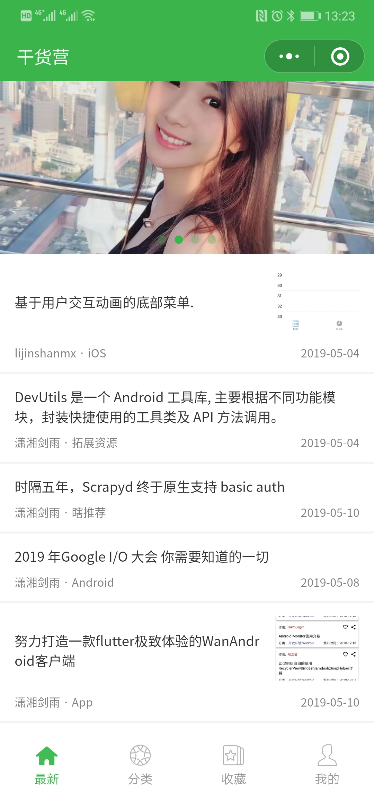
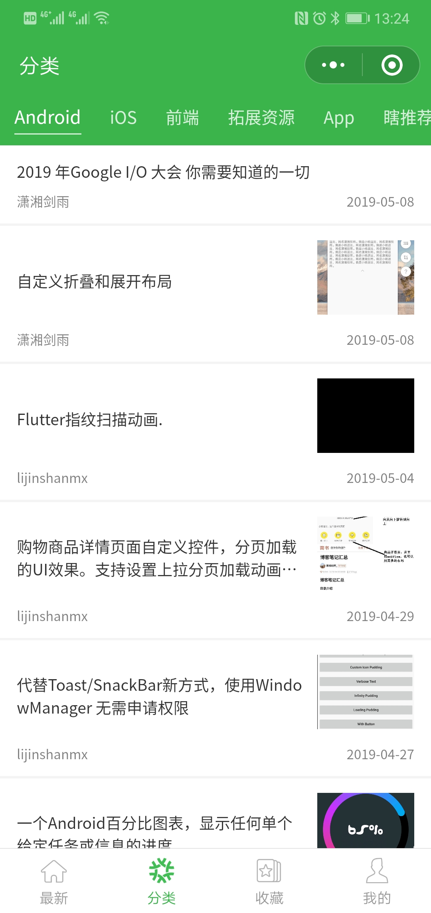
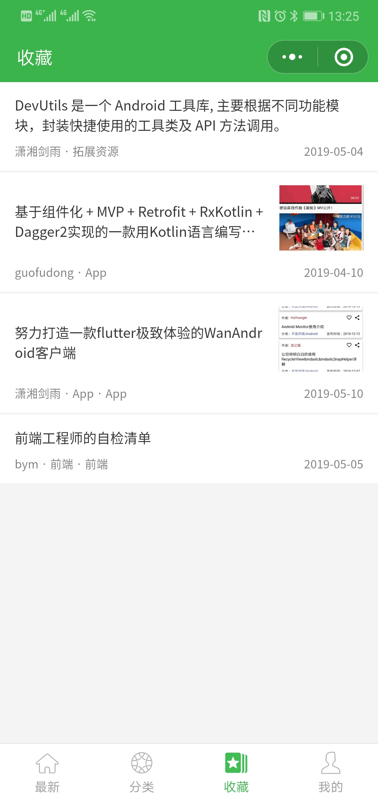
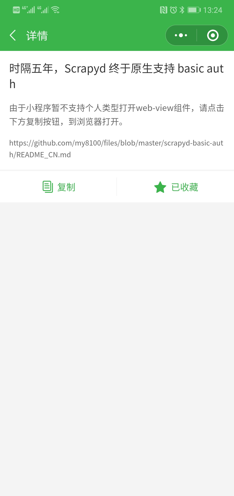
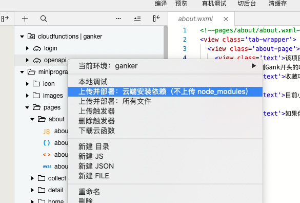

# GankMini

GankMini是[干货集中营](https://gank.io)移动端全家桶系列第三篇，之前已经实现了Flutter，React Native开发，后续版本会推出kotlin版，敬请期待

[同款Flutter干货集中营](https://github.com/fujianlian/GankFlutter)

[同款Kotlin干货集中营](https://github.com/fujianlian/GankKotlin)

[同款React Native干货集中营](https://github.com/fujianlian/GankRN)

## 目录

- [界面效果](#界面效果)

- [项目运行](#项目运行)

- [小程序项目](#小程序项目)

- [特别感谢](#特别感谢)

- [后记](#后记)

## 界面效果

* 直接扫描二维码体验

* 页面截图

 |  |  |  |
| :--: | :--: | :--: | :--: |
| 最新 | 分类 | 收藏 | 详情 |

## 项目运行

下载代码使用微信开发者导入项目，将appid修改为自己申请的，初次运行，需要部署云函数

关于云开发，可以参考以下信息

### 云开发 quickstart

这是云开发的快速启动指引，其中演示了如何上手使用云开发的三大基础能力：

- 数据库：一个既可在小程序前端操作，也能在云函数中读写的 JSON 文档型数据库
- 文件存储：在小程序前端直接上传/下载云端文件，在云开发控制台可视化管理
- 云函数：在云端运行的代码，微信私有协议天然鉴权，开发者只需编写业务逻辑代码

### 参考文档

- [云开发文档](https://developers.weixin.qq.com/miniprogram/dev/wxcloud/basis/getting-started.html)

## 小程序项目

如果你对微信小程序比较感兴趣，可以参考我的其他小程序项目，难度逐渐增加

* [天气](https://github.com/fujianlian/wechat-weather)

* [闲读 ∙ 资讯(新闻类 项目实战)](https://github.com/fujianlian/leisure-news)

* [Mall(商城类 项目实战)](https://github.com/fujianlian/mall)

* [侃影评(影评类 项目实战)](https://github.com/fujianlian/movie)

## 特别感谢

* api提供：[@代码家](https://github.com/daimajia)

* [干货集中营](https://gank.io)

## 后记

* 如果你在使用过程中遇到问题，欢迎给我提Issue

* 如果你有好的想法，欢迎pull request

* 觉得不错的话，顺手 **点个Star**，笔者需要您的支持

